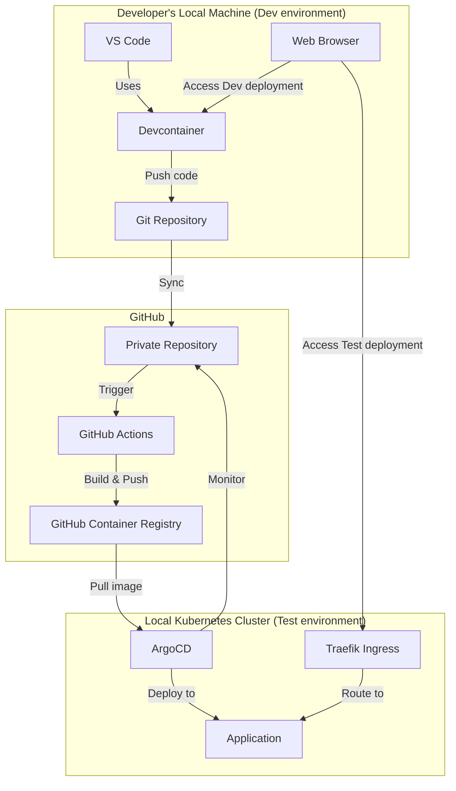
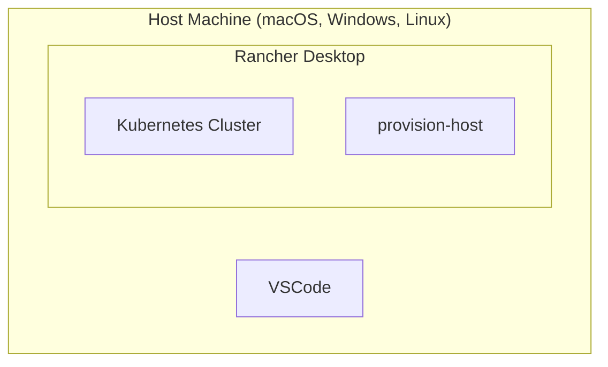
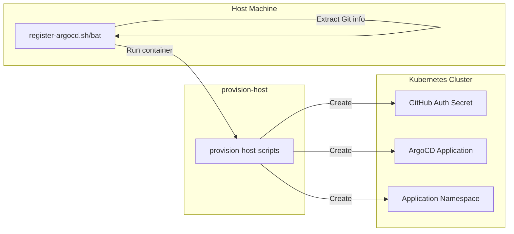
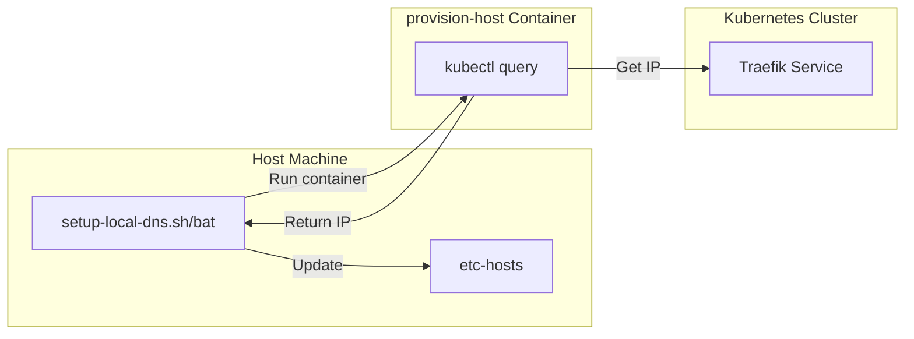
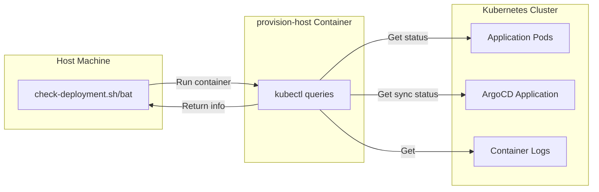

# Urbalurba-infrastructure Developer Platform

## Executive Summary

The urbalurba-infrastructure provides the stuff needed to make development fun and easy for developers.

It provides a development platform that developers can use to develop, test and deploy their systems without deep knowledge about undelyting infrastructure like kubernetes, GitOps and other facy terms.

A developer should be free to write code and not worry about the underlying infrastructure.

Urbalurba-infrastructure sets up a local kubernetes cluster that follow the latest GitOps principles and provides a set of tools that makes it easy to develop, test and deploy applications.
Providing a seamless developer experience consistent with latest tooling and workflows.

### Case: Red Cross Norway volunteer developer platform

The Norwegian Red Cross supports over **40,000 volunteers** across **380+ local branches**, many of whom have technical skills and see opportunities for IT improvements. This solution creates a streamlined path for these volunteers to develop, test, and contribute IT solutions that can ultimately be adopted by the organization, enabling a better flow from volunteer innovation to organizational adoption.

## Benefits

### For Volunteers and Developers

- **Lower barrier to entry** for technical volunteers and new developers
- **Self-service setup** that reduces onboarding time
- **Fast feedback** through local testing and deployment
- **Familiar tools** like VS Code, GitHub, and modern frameworks
- **Production-like environment** for testing applications

### For Red Cross IT Department

- **Predictable and maintainable** application structure
- **Standardized project templates** that follow best practices
- **Seamless handover** of code from volunteers to IT staff
- **Scalable model** that supports multiple projects and contributors
- **Reduced integration overhead** when adopting volunteer-created solutions

### For the Organization

- **Harness volunteer technical skills** more effectively
- **Accelerate innovation** from field operations to organization-wide solutions
- **Improve volunteer experience** by providing professional-grade tools
- **Ensure security and compliance** through standardized infrastructure
- **Enable collaboration** between volunteers, staff, and external partners

## Conclusion

By providing a simple, flexible, and powerful local development setup, the Norwegian Red Cross can harness the technical skills of its volunteers and staff to build better systems. With GitOps and Kubernetes as the foundation, and with automation and templates smoothing the path, we can ensure that good ideas from the field don't get lost—they get adopted, improved, and brought into production.

This platform enables collaboration, learning, and innovation—and most importantly, helps support volunteers more effectively as they help others. The ArgoCD integration creates a seamless development experience for Red Cross developers and volunteers, allowing them to focus on building valuable solutions instead of dealing with complex infrastructure.

The GitOps approach ensures consistent, automated deployments while the scripted setup minimizes the learning curve. By implementing this strategy, the Red Cross platform will meet the goals outlined in the project overview: enabling volunteers to contribute effectively, providing a consistent development environment, and ensuring that good ideas can be quickly brought into production.

## Architecture Overview



### Key Components

- **VS Code + Devcontainers**: Provides a consistent development environment for application code
- **Rancher Desktop**: Delivers local Kubernetes clusters for developers
- **ArgoCD**: Handles GitOps-based deployment of applications
- **Traefik**: Ingress controller pre-installed in the cluster for routing
- **GitHub Actions**: Automated CI/CD pipelines for building and pushing container images
- **GitHub Container Registry**: Storage for container images
- **provision-host**: Utility container with administrative tools for configuration

## Urbalurba-infrastructure Setup

Installing the `urbalurba-infrastructure` repository and setting up the local development environment is a one-time process. This is done by running a script that sets up the local Kubernetes cluster and installs all necessary tools in a container.



### 1. Install Rancher Desktop

- Developer installs Rancher Desktop on their local machine
- This provides the Kubernetes cluster and container runtime needed for local development

### 2. Clone Infrastructure Repository

- Developer clones the `urbalurba-infrastructure` repository
- One script sets up a kubernetes cluster with tools and services needed to develop and deploy applications.
- An utilities container `provision-host` for managing the local cluster and providing administrative tools.
- No code or programs are installed you your local machine, all needed tools are installed in the container. Everyone has the same setup, and the setup is the same on all platforms (macOS, Windows, Linux).

## Setting up for local development

### Initiating a new project

This step is done once for a new project.

#### 1. Create GitHub Repository

- Developer creates a new private repository in GitHub and clones it to their local machine.
- Just like any other GitHub repository, this is where the code will be stored and versioned.

#### 2. Setup Developer Toolbox

The developer-toolbox is a set of tools for development of various applications. With this you can develop Python, JavaScript/TypeScript, C-sharp etc. It uses devcontainer so that everyone has the same setup, and the setup is the same on all platforms (macOS, Windows, Linux).
See [https://github.com/norwegianredcross/devcontainer-toolbox](https://github.com/norwegianredcross/devcontainer-toolbox) for more information.

- Developer runs a script that sets up the developer-toolbox. It sets up devcontainer and installs all the tools needed for development.
- Developer starts VS Code and pushes an initial commit to GitHub
- This verifies that the basic Git setup is working properly

#### 3. Select Project Template

- Inside the devcontainer, developer runs `.devcontainer/dev/dev-template.sh`
- This allows them to select an appropriate template for their project type. Eg `typescript-basic-webserver`, `python-basic-webserver`, etc.
- The script sets up the project structure, Kubernetes manifests, and GitHub Actions workflows

#### 4. Local development environment

- Developer runs the project template locally to verify it works correctly.
- This ensures the development environment is properly configured
- Developer can itterate on the code and test it locally just like any other development setup.

#### 5. Push app to GitHub / test environment

We use GitHub Actions to build and push the container image to the GitHub Container Registry. All this is automated and the developer does not need to worry about it.

- Developer pushes the code to GitHub (nothing new or fancy here)
- This triggers the GitHub Actions workflow
- The workflow builds the container image and pushes it to the GitHub Container Registry
- The developer go to the GitHub Actions web page and verify the status of the build.

#### 6. Deploy app to test environment

The test environment is the local Kubernetes cluster on the developers machine.
To make the cluster autimatically pull the built image from the GitHub Container Registry every time the developer pushes code/app updates to GitHub, we need to register the application with ArgoCD.

This is done once for each project. And the scripts must be run from the host machine, not from inside the devcontainer.

- From the host machine, developer runs `./urbalurba-scripts/register-argocd.sh` (or `.bat` on Windows)
- This script uses the `provision-host` container to talk to the kubernetes cluster and register the repository with ArgoCD
- Developer verifies that ArgoCD successfully pulls the application from GitHub and deploys it to the local cluster by running the `./urbalurba-scripts/check-deployment.sh` (or `.bat` on Windows) script.

#### 7. Test app in local cluster

ArgoCD deploys the application to the local Kubernetes cluster. But in order to access the application, we need to set up a local DNS entry that points to the application.

We do this by adding the app/repository name to the local hosts file. This so that the developer can access the app at `http://<repo-name>.local` in their browser.

This is done once for each project. And the scripts must be run from the host machine, not from inside the devcontainer.

- From the host machine, developer runs `./urbalurba-scripts/setup-local-dns.sh` (or `.bat` on Windows)
- This adds a local DNS entry pointing to the application
- Developer can now access the app at `http://<repo-name>.local` in their browser

#### 8. Ongoing Development

The development workflow is now set up and the developer can start working on the application.

The developer now write and run the code locally inside the devcontainer. Testing during development is is done locally and the developer can itterate on the code and test it locally just like any other development setup.

When the developer want to test how the code will run in a production-like environment, they can push the code to GitHub and ArgoCD will automatically deploy the application to the local Kubernetes cluster.

#### 9. Sharing and Handover to production

When a solution is ready for sharing or evaluation by central IT, the code is already in a structured, familiar format that follows best practices and GitOps workflow.

## Technical Details

As developer you dont need to read this. But if you are interested in how the system works, this section describes the technical details of the system.

### Folder Structure

There are several templates for different types of applications. The folder structure is designed to be simple and easy to understand. The following is an example of the folder structure for a TypeScript web server application:

```plaintext
project-repository/
├── .github/workflows/           # GitHub Actions workflows
│   └── urbalurba-build-and-push.yaml
├── app/                         # Application code
│   └── index.ts
├── manifests/                   # Kubernetes manifests for ArgoCD
│   ├── deployment.yaml
│   ├── ingress.yaml
│   └── kustomization.yaml
├── urbalurba-scripts/           # Utility scripts for platform integration
│   ├── register-argocd.sh       # macOS/Linux registration script
│   ├── register-argocd.bat      # Windows registration script
│   ├── setup-local-dns.sh       # macOS/Linux DNS setup
│   ├── setup-local-dns.bat      # Windows DNS setup
│   ├── check-deployment.sh      # macOS/Linux deployment status
│   └── check-deployment.bat     # Windows deployment status
├── Dockerfile                   # Container definition
├── package.json
├── tsconfig.json
└── README.md
```

### urbalurba-scripts Design and Functionality

#### Registration Scripts

The registration process involves scripts that run on the developer's host machine and connect to the `provision-host` container:



**Key workflow:**

1. The host script (`register-argocd.sh`/`register-argocd.bat`) extracts Git repository information
2. It runs the provision-host container, passing repository information and GitHub token
3. The container script (`/scripts/register-app.sh`) creates:
   - A namespace for the application
   - A Kubernetes secret for GitHub authentication
   - An ArgoCD Application resource

#### Local DNS Scripts

These scripts configure the developer's machine to access the application through Traefik Ingress:



TODO: verify this

**Key workflow:**

1. The host script runs the provision-host container to query Traefik's IP address
2. It adds or updates an entry in the hosts file mapping `<repo-name>.local` to that IP

#### Deployment Status Scripts

These scripts provide developers with visibility into their application's deployment status:



### Kubernetes Manifest Design

The manifests are structured to be automatically parameterized during template setup. The files are in the `manifests/` directory and are used by ArgoCD to deploy the application.

- **deployment.yaml**: Defines the application Deployment and Service
- **ingress.yaml**: Configures Traefik to route traffic to the application
- **kustomization.yaml**: Ties the resources together for ArgoCD

