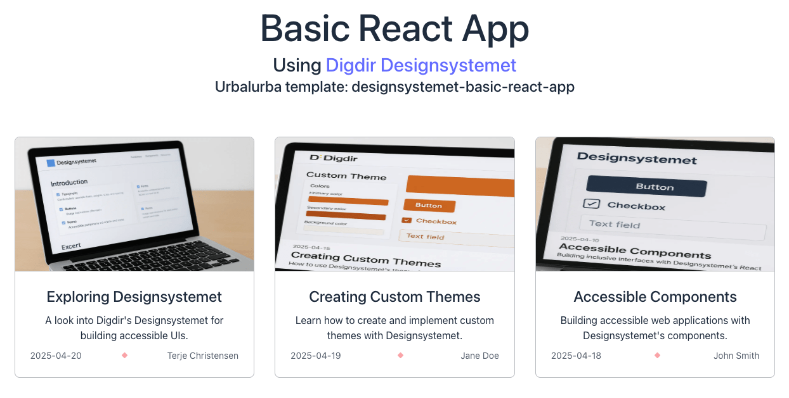

# Designsystemet Basic React App

File: templates/designsystemet-basic-react-app/README-designsystemet-basic-react-app.md

This is a simple React application template that integrates the [Designsystemet](https://github.com/digdir/designsystemet) from Digdir to create a blog page. The template displays a list of blog posts as cards, each with a title, excerpt, date, and an image, sourced from a JSON file.

Screenshot of the simple blog page:



## Purpose

The purpose of this template is to provide a minimal starting point for developers who want to build a blog page using Designsystemet's components and styling. It demonstrates how to set up a React/Vite app with Designsystemet, use its components (e.g., Card, Heading, Paragraph), and structure data for a blog using a JSON file.

## Features

- Blog page displaying posts as cards with images, titles, excerpts, and dates.
- Uses Designsystemet's CSS and React components for consistent, accessible UI.
- Data sourced from a `blog-posts.json` file for easy content updates.
- Built with Vite and React for fast development and modern tooling.
- TypeScript support for type-safe development.
- Inter font integration as recommended by Designsystemet.

## Prerequisites

The devcontainer-toolbox sets up everything you need to run this project locally.
See the repo https://github.com/norwegianredcross/devcontainer-toolbox on how to set it up.
When you have the devcontainer-toolbox set up, you type the following command in your terminal:

```bash
.devcontainer/dev/dev-template.sh
```

Then you select this template from the list:

```plaintext
1. designsystemet-basic-react-app
```

## Getting Started

Once you have installed the template you are ready to start developing.

Run the following commands to build and run the server locally:

```bash
npm install
npm run dev
```

You will see the following output:

```plaintext
npm install

added 163 packages, and audited 164 packages in 1m

44 packages are looking for funding
  run `npm fund` for details

found 0 vulnerabilities

npm run dev

> designsystemet-basic-react-app@0.0.0 dev
> vite


  VITE v6.3.2  ready in 1234 ms

  ➜  Local:   http://localhost:3000/
  ➜  Network: http://172.17.0.2:3000/
  ➜  press h + enter to show help

```

This means the server is running and listening on port 3000. You can access it by navigating to `http://localhost:3000` in your web browser.
You will see the sample list of blog posts.


## Deploying to Kubernetes on your local machine

TODO: Add instructions for deploying to Kubernetes on your local machine.

## File structure

```plaintext
├── public/
│   ├── images/
│   │   ├── exploring-designsystemet.webp
│   │   ├── creating-custom-themes.webp
│   │   └── accessible-components.webp
│   └── vite.svg
├── src/
│   ├── App.tsx
│   ├── App.css
│   ├── main.tsx
│   ├── index.css
│   ├── vite-env.d.ts
│   ├── data/
│   │   └── blog-posts.json
│   ├── components/
│   │   └── BlogCard/
│   │       ├── BlogCard.tsx
│   │       └── BlogCard.module.css
│   └── types/
│       └── BlogPost.ts
├── .dockerignore
├── .gitignore
├── LICENSE
├── Dockerfile
├── index.html
├── package.json
├── package-lock.json
├── eslint.config.js
├── tsconfig.json
├── tsconfig.app.json
├── tsconfig.node.json
├── vite.config.ts
├── manifests/
│   ├── deployment.yaml
│   ├── ingress.yaml
│   └── kustomization.yaml
└── README-designsystemet-basic-react-app.md
```
